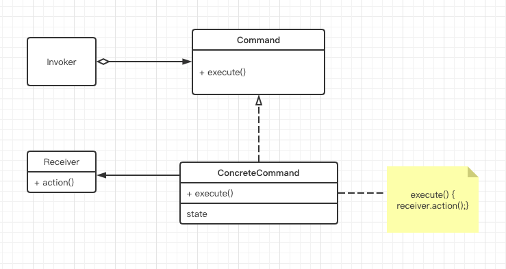
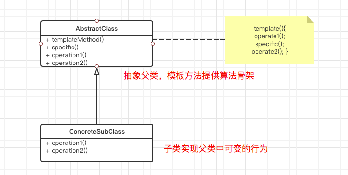
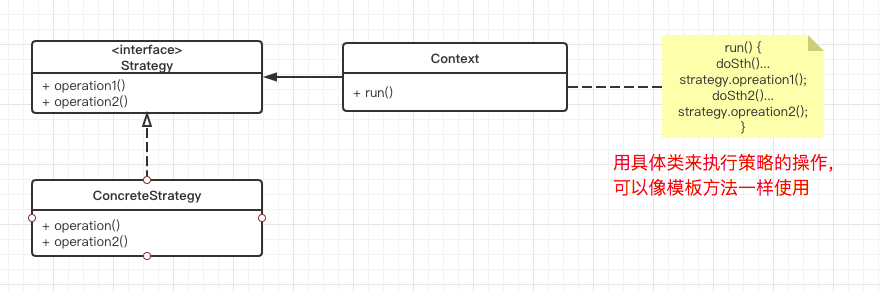
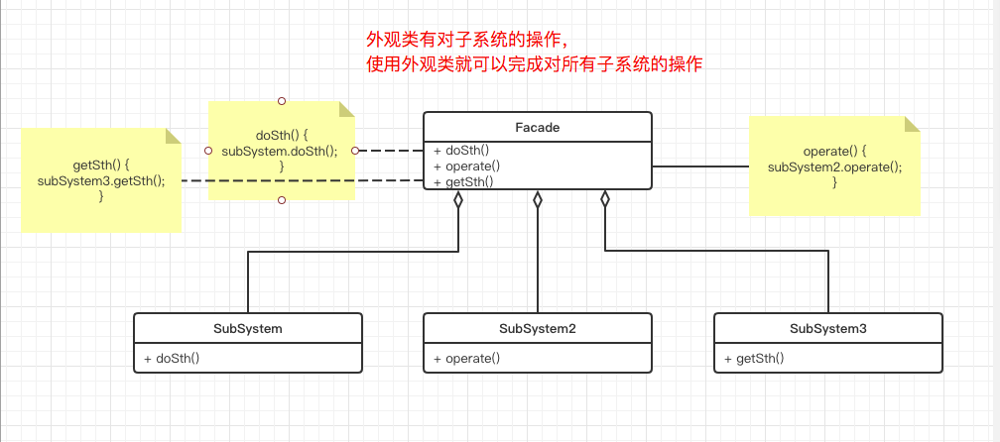
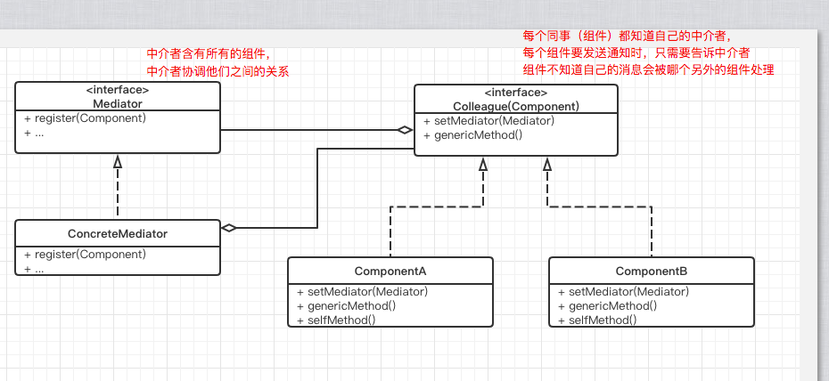
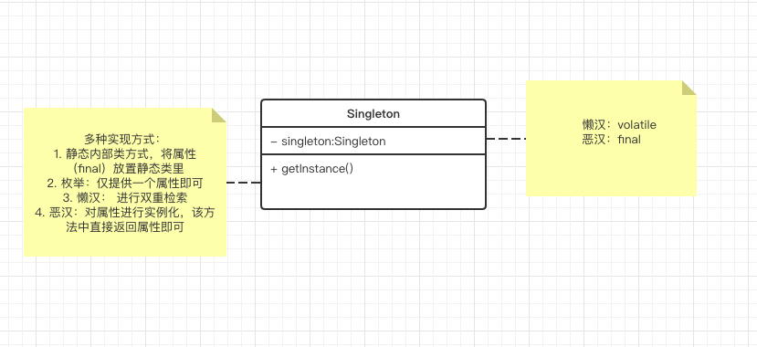

## 第七章 什么是敏捷设计

（敏捷）开发人员知道要做什么，是因为：

1. 遵循敏捷**实践**去发现问题
2. 应用设计**原则**去诊断问题
3. 应用适当的**设计模式**去解决问题

软件开发的这三个方面间的相互作用就是设计

### 结论

什么是敏捷设计呢？敏捷设计是一个过程，不是一个事件。它是一个持续性的应用**原则，模式以及实践**来改进软件的结构和可读性的过程。它致力于保持系统设计在任何时间都尽可能得简单、干净以及富有表现力

请记住，敏捷开发人员不会对一个庞大的预先设计应用那些原则和模式。相反，这些原则和模式被应用在一次次的迭代中，力图使代码以及代码所表达的设计保持干净

## 第八章 单一职责原则（Single Responsibility Principle）

如果一个类承担的职责过多，就等于把这些职责耦合在了一起。一个职责的变化可能会削弱或者抑制这个类完成其他职责的能力。这种耦合会导致脆弱的设计，当变化发生时，设计会遭受到意想不到的破坏

为何要把多个职责分离到单独的类中呢？因为每一个职责都是变化的曲线（意为需求时刻在变化）。当需求变化时，该变化就会反映为类的职责的变化。如果一个类承担了多余一个职责，那么引起它变化的原因就会有多个

### 脆弱性

对系统的改动会导致系统中和改动的地方在概念上无关的许多地方出现问题

## 第九章 开放—封闭原则（Open Closed Principle）

遵循开放封闭原则设计出的模块具有两个主要特征：

1. 对于拓展是开发的
2. 对于修改是封闭的

开发人员应该仅仅对程序中呈现出频繁变化的那些部分作出抽象。拒绝不成熟的抽象和抽象本身一样重要

## 第十章 Liskov 替换原则（Liskov Substitution Principle）

解释：继承必须确保超类所拥有的性质在子类中仍然成立，通俗来讲就是：子类继承父类时，除添加新的方法完成新增功能外，尽量不要重写父类的方法

里氏替换原则是实现开闭原则的重要方式之一

**正是因为子类的可替换性才使得使用基类类型的模块在无需修改的情况下就可以扩展**

继承时不应该只关注”IS A“（”IS A“过于宽泛不能作为子类型的定义）关系，更重要的是行为方式（理解为具体的行为），行为方式是可以进行合理假设的，是客户程序所依赖的

若继承违背了LSP，可以考虑用提取公共部分的方法代替继承（继承自公共部分）

## 第十一章 依赖倒置原则（Dependence Inversion Principle）

依赖倒置原则是实现开闭原则的重要途径之一，它降低了客户与实现模块之间的耦合

高层模块若依赖于低层模块，那么对低层模块的改动将会直接影响到高层模块

> 所有结构良好的面向对象结构都具有清晰的层次定义，每个层次通过一个定义良好的、受控的接口向外提供了一组内聚的服务

对于DIP有个简单的启发式规则：”依赖于抽象“。也就是说，程序中所有的依赖关系都应该终止与抽象类或者接口（参数应该是接口）

根据该启发规则可知：

- 任何变量都不应该持有一个指向具体的指针或引用
  - 正例：private Father father;
  - 反例：private Child child;
- 任何类都不应该从具体类派生
  - 正例：private Father father = new Child();
  - 反例：private Child child = new Child();
- 任何方法都不应该覆盖基类中已经实现了的方法（尽量遵循LSP）

通过以上规则，我们可以推出应该为所有的类创建父类（接口，抽象类，父类）

**依赖倒置原则的目的是通过要面向接口的编程来降低类间的耦合性**

当然，每个程序中都有会违反该规则的情况（视具体情况而定，有时需要覆盖基类的方法等）

**我们应用中所编写的大多是具体类都是不稳定的，我们不想直接依赖于这些不稳定的具体类。通过把他们隐藏在抽象接口的后面，可以隔离他们的不稳定性**

## 第十二章 接口隔离原则（Interface Segregation Principle）

ISP要求程序员尽量将臃肿庞大的接口拆分成更小的和更具体的接口，让接口中只包含客户感兴趣的方法

当一个客户程序要求一个臃肿的类（接口 fat class）进行一个改动时，会影响到所有其他的客户程序

## 第十三章 COMMAND模式

### COMMAND模式

命令模式：将一个请求封装为一个对象，使发出请求的责任和执行请求的责任分割开（将调用操作的对象（调用者）和知道如何实现该操作（实现者）的对象解耦）

命令模式可以被轻易的扩展和删除（增加删除类）而不会影响到其他类

#### 结构



某调用者存储具体的命令对象，该调用者调用命令对象的方法来提交一个请求。（如果该请求是可以撤销的，具体的命令对象在执行方法之前存储当前状态用意取消该命令）具体的命令对象调用接收者对象的方法来执行该请求

调用者调用命令对象来执行请求（不关心具体命令），命令对象执行接收者的操作

## 第十四章 TEMPLATE METHOD模式和STRATEGY模式：继承与委托

模板方法模式和策略模式所解决的问题是类似的，而且常常可以互换。不过，模板方法模式使用继承来解决问题，而策略模式使用的则是委托（委托指的是在A类中以各种方式利用B类（关联、依赖），完成类的功能）

ps：优先使用对象组合而不是类继承，所以我们减少了对继承的使用，常常使用组合或者委托来代替它

**模板方法模式允许一个通用算法操作多个可能的具体实现，而策略模式完全遵循DIP原则，使得每个具体实现都可以被多个不同的通用算法操作**

### TEMPLATE METHOD模式

模板方法模式：定义一个算法的骨架（步骤是明确的），将具体的实现交由子类实现。简答来讲就是一次性实现一个算法的不变部分，将可变行为交给子类实现

#### 结构



父类可提供钩子方法（判断逻辑），使用钩子方法可以使子类控制父类的行为

#### 适用性

- 一次性实现一个算法的不变部分，并将可变的行为留给子类来实现
- 子类中的公共行为被提取出来集中到一个公共父类中以避免代码重复

### STRATEGY模式

策略模式：定义一系列算法，将算法封装起来，并且使得他们可以互换

策略模式的重心不是如何实现算法，而是如何组织这些算法，从而让程序结构更加灵活，具有更好的维护性和扩展性

大部分时候策略模式可以和模板方法模式互换

#### 结构



#### 适用性

- 许多相关的类仅仅是行为不同
- 需要一个算法的不同变体
- 一个类定义了多种行为，并且这些行为在这个类的操作中以多个条件语句的形式出现

## 第十五章 FACADE模式和MEDIATOR模式

这两个设计模式有着共同的目的：将某种策略施加到另一组对象上

外观者模式是客户与接口之间的联系

中介者模式是对象与对象之间的联系

每个人应该使用FACADE而不是隐藏于其下的对象，MEDIATOR对用户是隐藏的，它的策略是既成事实的而不是一项约定事务

### FACADE模式

外观模式：为多个子系统提供统一高层的接口，使得子系统更加容易被访问而不必关心子系统的具体实现

只要是高层模块需要调度多个子系统（2个以上的类对象），我们都会自觉地创建一个新的类封装这些子系统，提供精简的接口，让高层模块可以更加容易地间接调用这些子系统的功能

#### 结构



#### 适用性

- 为复杂子系统提供一个简单接口
- 客户端与抽象类的实现部分之间有很大的依赖性

### MEDIATOR模式

中介者模式： 将一组相关的对象之间混乱无序的依赖关系交给一个中介者对象进行合作

对象之间不会直接交流，即使看上去它们应该这样做（它们的交流渠道是向中介者发送通知）。对象只需要中介者知晓事件即可

#### 结构



#### 适用性

- 一组对象以定义良好但复杂的方式进行通信，产生的相互依赖关系结构混乱且难以理解
- 一个对象引用其他很多对象并且直接与这些对象通信，导致难以复用该对象
- 常被用来协调相关的GUI组件

## 第十六章 SINGLETON模式

### SINGLETON模式

单例模式：保证一个类只有一个实例，并提供一个访问该实例的全局节点

#### 结构



```java
// 恶汉
private static final Singleton singleton = new Singleton();

private Singleton() {
}

public static Singleton getInstance() {
    return singleton;
}
```

```java
// 懒汉双检索
private static volatile DoubleCheck doubleCheck;

private DoubleCheck() {

}

public static DoubleCheck getInstance() {
    if (doubleCheck == null) {
        synchronized (DoubleCheck.class) {
            if (doubleCheck == null) {
                doubleCheck = new DoubleCheck();
            }
        }
    }
    return doubleCheck;
}
```

```java
// 枚举单例
public enum EnumSingleton {
    INSTANCE
}
```

```java
// 静态内部类
private static class Singleton {
    private static final InnerSingleton INSTANCE = new InnerSingleton();
}

private InnerSingleton() {

}

public static InnerSingleton getInstance() {
    return Singleton.INSTANCE;
}
```

#### 适用性

- 当一个类只有一个实例且客户可以从一个总所周知的访问点访问时

